# 去中心化募捐平台
## 背景
针对社会上急需帮助的群体性事件，如：支持乌克兰，涿州水灾，流浪动物救助，留守儿童失学 等问题，又因为xxx等募捐机构不公开账目，存在侵吞募捐款的可能，现基于区块链去中心化的能力，真正做到公开透明的原则搭建此去中心化募捐平台，发布募捐活动，募集NEAR，为救助对象提供帮助；
## 平台主要能力
```shell
1、发布募捐活动，募集near币
2、用户参与募捐活动，向募捐指定账户转入NEAR
3、展示募捐活动详情：参与募捐的人和当前募捐到的NEAR
```

## 代码仓库
合约代码：https://github.com/guozhouwei/near_crowdfunding_demo/blob/main/near_crowdfunding/src/lib.rs
near-api-js: https://github.com/guozhouwei/near_crowdfunding_site/blob/main/src/main.ts
react + near-api-js: https://github.com/guozhouwei/near_crowdfunding_demo/blob/main/src/App.js

## 合约
### 业务逻辑图


### 部署和交互
#### 账户
假设你注册了4个测试网账户:
```shell
1. 主账户（同合约部署签名账户）owner123.testnet
2. 合约账户 contract1234501.testnet
3. 募捐人账户 zhouzhou_near.testnet 等
```

##### 以上账户私钥保存在 legacy keychain 中
```shell
near account import-account using-seed-phrase "${YOUR_SEED_PHRASE}" --seed-phrase-hd-path 'm/44'\''/397'\''/0'\''' network-config testnet

```

#### 编译募捐合约
1. 进入项目目录
    ```shell
   cd ./near_crowdfunding
    ```
2. 安装 WASM 工具链
    ```shell
   rustup target add wasm32-unknown-unknown
    ```
3. 编译合约
    ```shell
   RUSTFLAGS="-C link-arg=-s" cargo build --target wasm32-unknown-unknown --release
    ```
4. 将合约 WASM 文件移动到项目根目录下方便后续操作
    ```shell
   mkdir -p ./res && cp ./target/wasm32-unknown-unknown/release/contract.wasm ./res/
    ```
以上操作已经封装在 makefile 文件中
    ```shell
   make all
    ```

#### 合约交互
1. 部署并初始化合约  
    ➔ 合约账户：contract1234501.testnet  
    ➔ near contract deploy contract1234501.testnet use-file ./res/contract.wasm with-init-call init json-args '{"owner_id":"owner123.testnet"}' prepaid-gas '100.000 TeraGas' attached-deposit '0 NEAR' network-config testnet sign-with-keychain send  
    ➔ 合约浏览器：https://explorer.testnet.near.org/transactions/FFAB7bzLQsyyGbUn5XMZTLWN4rvbJA1npXHjuuzPmj6H  

    1.1 （补充）重新部署合约，覆盖原合约  
    ➔ 合约账户：contract1234501.testnet  
    ➔ near contract deploy contract1234501.testnet use-file ./res/contract.wasm without-init-call init json-args '{"owner_id":"owner123.testnet"}' prepaid-gas '100.000 TeraGas' attached-deposit '0 NEAR' network-config testnet sign-with-keychain send  
    ➔ 合约浏览器：https://explorer.testnet.near.org/transactions/HQTcvycQ8CXd8YA5WtQ5FzNCvQbRan4ENaGGqdsnwaAK 

2. 调用 newCampaign 方法，创建募捐活动  
    ➔ 募捐活动接收账户：owner123.testnet  
    ➔ near contract call-function as-transaction contract1234501.testnet newCampaign json-args '{"theme":"涿州水灾募捐活动","receiver":"owner123.testnet","number_funders":0,"funding_goal":100}' prepaid-gas '100.000 TeraGas' attached-deposit '0 NEAR' sign-as owner123.testnet network-config testnet sign-with-keychain send  
    ➔ 合约浏览器：https://explorer.testnet.near.org/transactions/A2ZVJi8ihQrAtLY9pQUFFALdJWwC2LDbFBJnbv9xoXv4  
    
3. 调用 get_crowdFunding_by_num_campagins 方法，查看创建的募捐活动  
    ➔ 募捐活动编号：1  
    ➔ near contract call-function as-transaction contract1234501.testnet get_crowdFunding_by_num_campagins json-args '{"num_campagins":1}' prepaid-gas '100.000 TeraGas' attached-deposit '0 NEAR' sign-as owner123.testnet network-config testnet sign-with-keychain send  
    ➔ 合约浏览器：https://explorer.testnet.near.org/transactions/BA9Rj1EM1Q2fLMmFpbagJd8YiTUCa7KbMb8D11ujEr8H  
    
4. 调用 bid 方法, 参与募捐活动  
    ➔ 参与募捐活动账户：zhouzhou_near.testnet  
    ➔ 发起转账 from： zhouzhou_near.testnet to ：contract1234501.testnet ，NEAR 88, 
    near contract call-function as-transaction contract1234501.testnet bid json-args '{"num_campagins":1}' prepaid-gas '100.000 TeraGas' attached-deposit '88 NEAR' sign-as zhouzhou_near.testnet network-config testnet sign-with-keychain send  
    ➔ 合约浏览器：https://explorer.testnet.near.org/transactions/F11L4erVatpe1JnKUk3GaXMrxN1aJEUvXKh3KaEx2h4g  
    
5. 调用 get_funders_by_num_campagins 方法, 查看活动募捐人列表  
    ➔ near contract call-function as-transaction contract1234501.testnet get_funders_by_num_campagins json-args '{"num_campagins":1}' prepaid-gas '100.000 TeraGas' attached-deposit '0 NEAR' sign-as owner123.testnet network-config testnet sign-with-keychain send  
    ➔ 合约浏览器：https://explorer.testnet.near.org/transactions/7rcGezoSa1cxqB7uMzofok9iynxeJ1K2ThLCw7VoG2fh  
    
##### 合约所有交易情况列表：  
    ➔ https://testnet.nearblocks.io/zh-cn/address/contract1234501.testnet  
        

## near-api-js （无react）
项目位置：https://github.com/guozhouwei/near_crowdfunding_site
### 执行命令
```shell
yarn start
```
### 日志log  
▶▶▶▶ 募捐活动编号:40  
▶▶▶▶ 创建募捐活动:'募捐活动编号:40,募捐活动名称:流浪动物救助募捐活动, 募捐收款账号:owner123.testnet, 目标募捐金额:500 NEAR, 参与募捐人数:0, 实际募捐金额:0 yocto (单位：1NEAR = 10^24yoctoNEAR，1NEAR = 10^12Tera)'  
▶▶▶▶ '第1位募捐人'  
▶▶▶▶ 捐赠后募捐活动:'募捐活动编号:40,募捐活动名称:流浪动物救助募捐活动, 募捐收款账号:owner123.testnet, 目标募捐金额:500 NEAR, 参与募捐人数:1, 实际募捐金额:8e+24 yocto (单位：1NEAR = 10^24yoctoNEAR，1NEAR = 10^12Tera)'  
▶▶▶▶ 募捐活动编码:40, 捐赠人:[ { addr: 'zhouzhou_near.testnet', amount: 8e+24 }, [length]: 1   

## react + near-api-js 页面交互
### 部署
1. 进入项目目录
    ```shell
   cd .     //进入目录 near_crowdfunding_demo
    ```
2. 安装配置，如 node_modules
    ```shell
   yarn install
    ```
3. 启动
    ```shell
   yarn start
    ```

## 页面操作展示
### 登陆页面
﹌﹌﹌﹌﹌﹌﹌﹌﹌﹌﹌﹌﹌﹌﹌﹌﹌﹌﹌﹌﹌﹌﹌﹌﹌﹌﹌﹌﹌﹌﹌﹌﹌﹌﹌﹌﹌﹌﹌﹌﹌﹌﹌﹌﹌﹌﹌﹌﹌﹌﹌
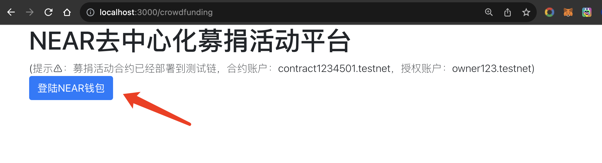
﹌﹌﹌﹌﹌﹌﹌﹌﹌﹌﹌﹌﹌﹌﹌﹌﹌﹌﹌﹌﹌﹌﹌﹌﹌﹌﹌﹌﹌﹌﹌﹌﹌﹌﹌﹌﹌﹌﹌﹌﹌﹌﹌﹌﹌﹌﹌﹌﹌﹌﹌
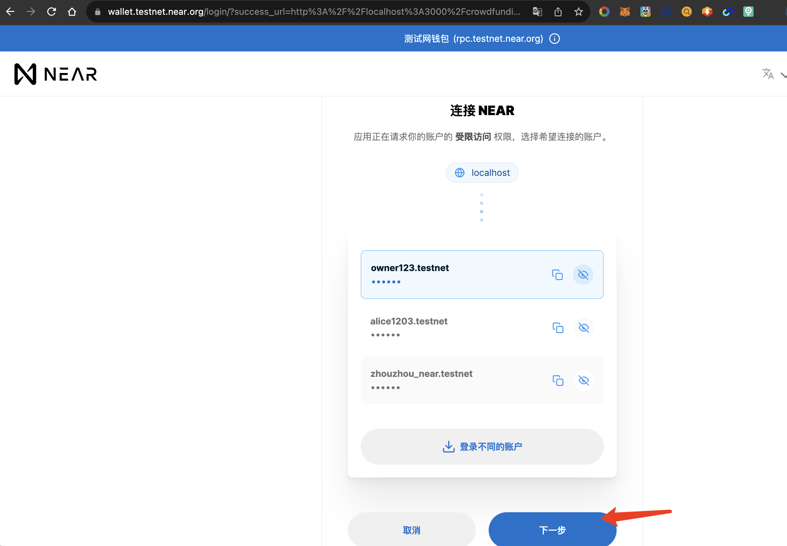
﹌﹌﹌﹌﹌﹌﹌﹌﹌﹌﹌﹌﹌﹌﹌﹌﹌﹌﹌﹌﹌﹌﹌﹌﹌﹌﹌﹌﹌﹌﹌﹌﹌﹌﹌﹌﹌﹌﹌﹌﹌﹌﹌﹌﹌﹌﹌﹌﹌﹌﹌
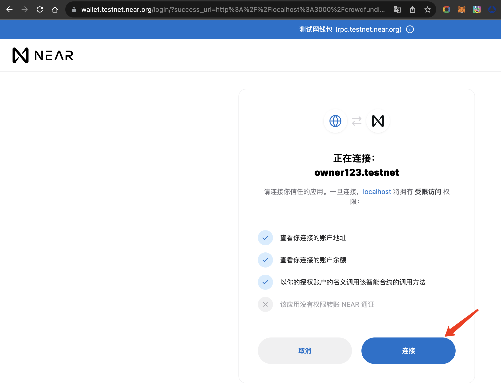
﹌﹌﹌﹌﹌﹌﹌﹌﹌﹌﹌﹌﹌﹌﹌﹌﹌﹌﹌﹌﹌﹌﹌﹌﹌﹌﹌﹌﹌﹌﹌﹌﹌﹌﹌﹌﹌﹌﹌﹌﹌﹌﹌﹌﹌﹌﹌﹌﹌﹌﹌
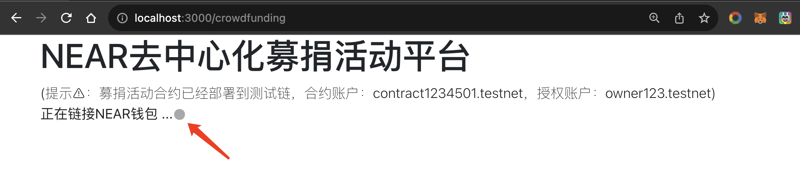
﹌﹌﹌﹌﹌﹌﹌﹌﹌﹌﹌﹌﹌﹌﹌﹌﹌﹌﹌﹌﹌﹌﹌﹌﹌﹌﹌﹌﹌﹌﹌﹌﹌﹌﹌﹌﹌﹌﹌﹌﹌﹌﹌﹌﹌﹌﹌﹌﹌﹌﹌

### 募捐合约授权人登陆页面展示
#### 募捐合约授权人权限：1、创建募捐活动的权利；2、展示所有募捐活动
﹌﹌﹌﹌﹌﹌﹌﹌﹌﹌﹌﹌﹌﹌﹌﹌﹌﹌﹌﹌﹌﹌﹌﹌﹌﹌﹌﹌﹌﹌﹌﹌﹌﹌﹌﹌﹌﹌﹌﹌﹌﹌﹌﹌﹌﹌﹌﹌﹌﹌﹌
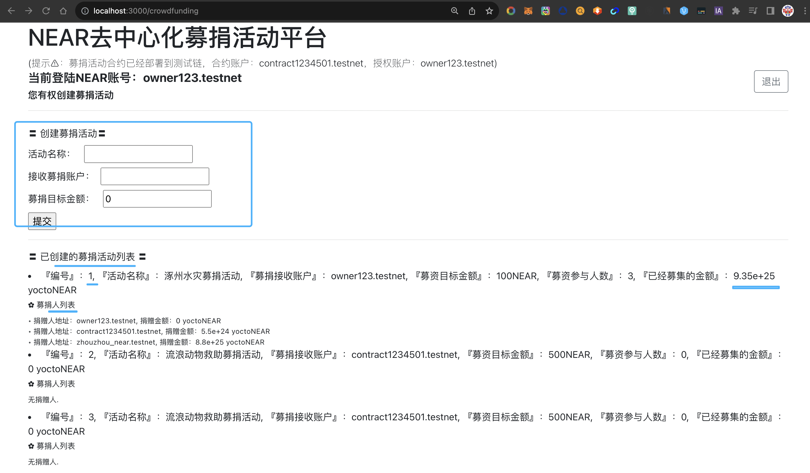
﹌﹌﹌﹌﹌﹌﹌﹌﹌﹌﹌﹌﹌﹌﹌﹌﹌﹌﹌﹌﹌﹌﹌﹌﹌﹌﹌﹌﹌﹌﹌﹌﹌﹌﹌﹌﹌﹌﹌﹌﹌﹌﹌﹌﹌﹌﹌﹌﹌﹌﹌
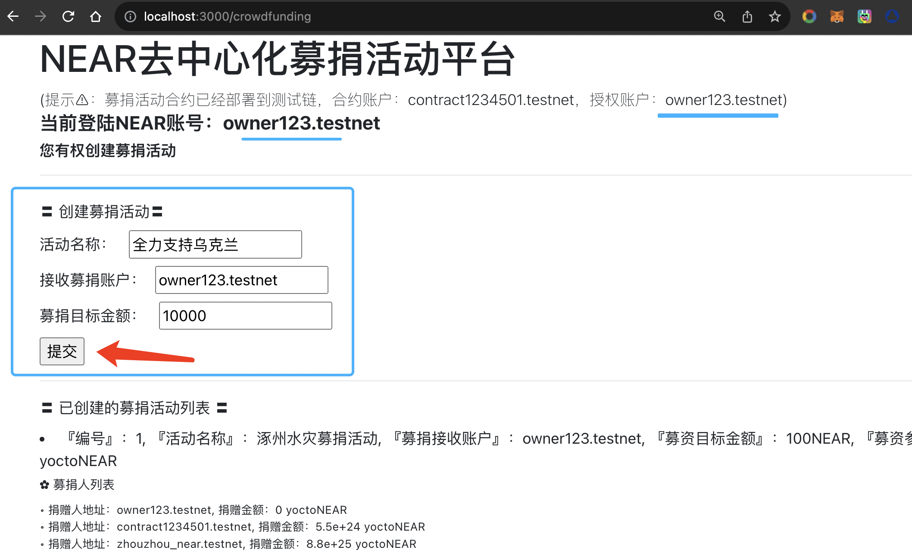
﹌﹌﹌﹌﹌﹌﹌﹌﹌﹌﹌﹌﹌﹌﹌﹌﹌﹌﹌﹌﹌﹌﹌﹌﹌﹌﹌﹌﹌﹌﹌﹌﹌﹌﹌﹌﹌﹌﹌﹌﹌﹌﹌﹌﹌﹌﹌﹌﹌﹌﹌
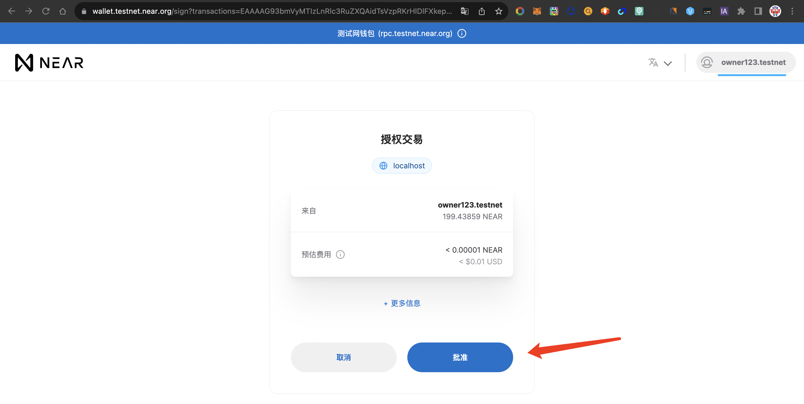
﹌﹌﹌﹌﹌﹌﹌﹌﹌﹌﹌﹌﹌﹌﹌﹌﹌﹌﹌﹌﹌﹌﹌﹌﹌﹌﹌﹌﹌﹌﹌﹌﹌﹌﹌﹌﹌﹌﹌﹌﹌﹌﹌﹌﹌﹌﹌﹌﹌﹌﹌
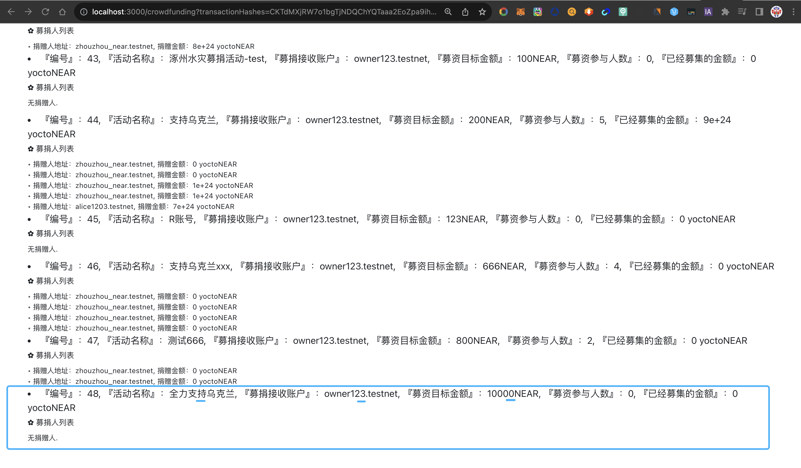
﹌﹌﹌﹌﹌﹌﹌﹌﹌﹌﹌﹌﹌﹌﹌﹌﹌﹌﹌﹌﹌﹌﹌﹌﹌﹌﹌﹌﹌﹌﹌﹌﹌﹌﹌﹌﹌﹌﹌﹌﹌﹌﹌﹌﹌﹌﹌﹌﹌﹌﹌
### 参与募捐人登陆页面展示
﹌﹌﹌﹌﹌﹌﹌﹌﹌﹌﹌﹌﹌﹌﹌﹌﹌﹌﹌﹌﹌﹌﹌﹌﹌﹌﹌﹌﹌﹌﹌﹌﹌﹌﹌﹌﹌﹌﹌﹌﹌﹌﹌﹌﹌﹌﹌﹌﹌﹌﹌
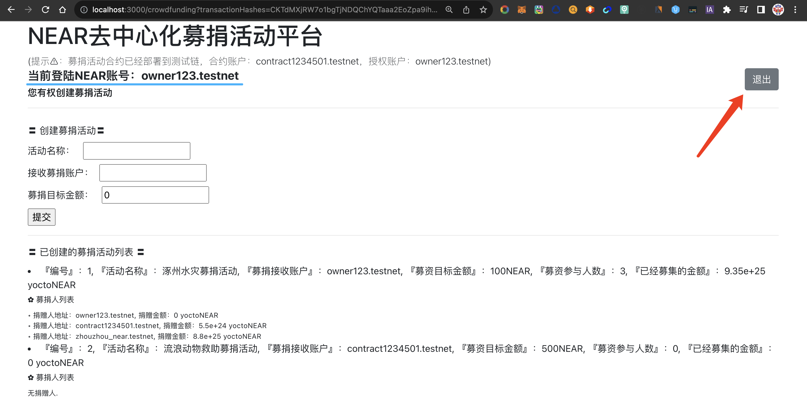
﹌﹌﹌﹌﹌﹌﹌﹌﹌﹌﹌﹌﹌﹌﹌﹌﹌﹌﹌﹌﹌﹌﹌﹌﹌﹌﹌﹌﹌﹌﹌﹌﹌﹌﹌﹌﹌﹌﹌﹌﹌﹌﹌﹌﹌﹌﹌﹌﹌﹌﹌
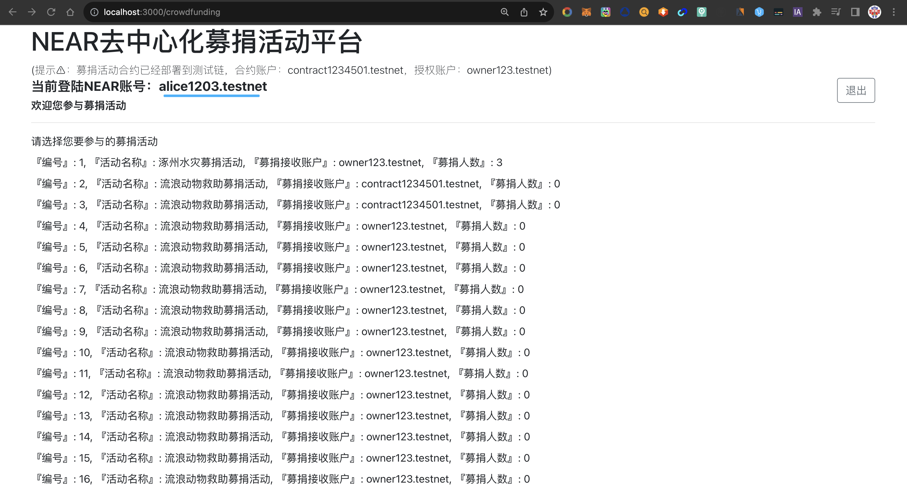
﹌﹌﹌﹌﹌﹌﹌﹌﹌﹌﹌﹌﹌﹌﹌﹌﹌﹌﹌﹌﹌﹌﹌﹌﹌﹌﹌﹌﹌﹌﹌﹌﹌﹌﹌﹌﹌﹌﹌﹌﹌﹌﹌﹌﹌﹌﹌﹌﹌﹌﹌

﹌﹌﹌﹌﹌﹌﹌﹌﹌﹌﹌﹌﹌﹌﹌﹌﹌﹌﹌﹌﹌﹌﹌﹌﹌﹌﹌﹌﹌﹌﹌﹌﹌﹌﹌﹌﹌﹌﹌﹌﹌﹌﹌﹌﹌﹌﹌﹌﹌﹌﹌
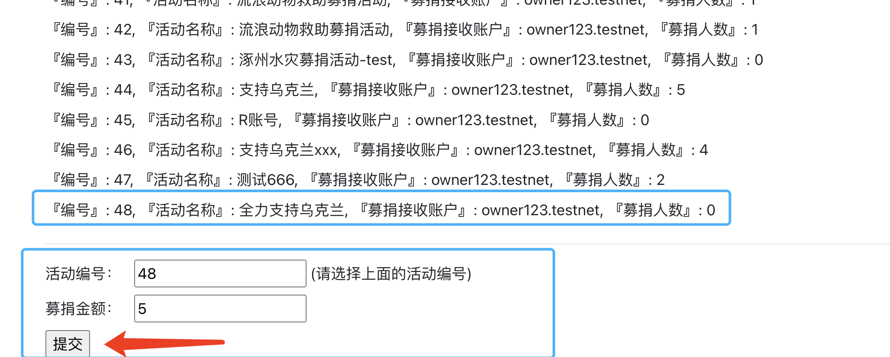
﹌﹌﹌﹌﹌﹌﹌﹌﹌﹌﹌﹌﹌﹌﹌﹌﹌﹌﹌﹌﹌﹌﹌﹌﹌﹌﹌﹌﹌﹌﹌﹌﹌﹌﹌﹌﹌﹌﹌﹌﹌﹌﹌﹌﹌﹌﹌﹌﹌﹌﹌
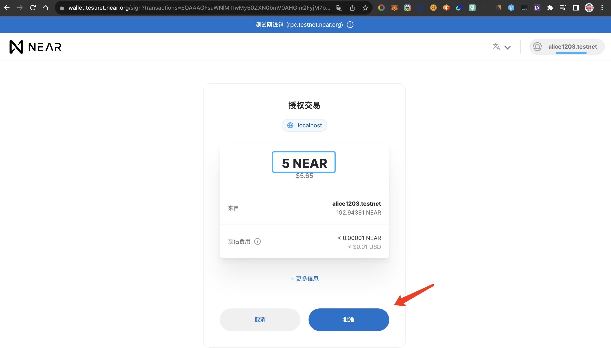
﹌﹌﹌﹌﹌﹌﹌﹌﹌﹌﹌﹌﹌﹌﹌﹌﹌﹌﹌﹌﹌﹌﹌﹌﹌﹌﹌﹌﹌﹌﹌﹌﹌﹌﹌﹌﹌﹌﹌﹌﹌﹌﹌﹌﹌﹌﹌﹌﹌﹌﹌
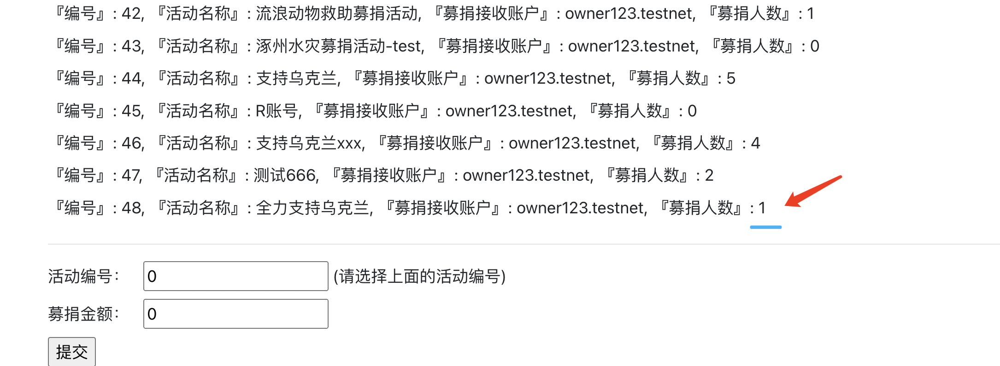
﹌﹌﹌﹌﹌﹌﹌﹌﹌﹌﹌﹌﹌﹌﹌﹌﹌﹌﹌﹌﹌﹌﹌﹌﹌﹌﹌﹌﹌﹌﹌﹌﹌﹌﹌﹌﹌﹌﹌﹌﹌﹌﹌﹌﹌﹌﹌﹌﹌﹌﹌
### 登陆合约授权人账户查看
﹌﹌﹌﹌﹌﹌﹌﹌﹌﹌﹌﹌﹌﹌﹌﹌﹌﹌﹌﹌﹌﹌﹌﹌﹌﹌﹌﹌﹌﹌﹌﹌﹌﹌﹌﹌﹌﹌﹌﹌﹌﹌﹌﹌﹌﹌﹌﹌﹌﹌﹌
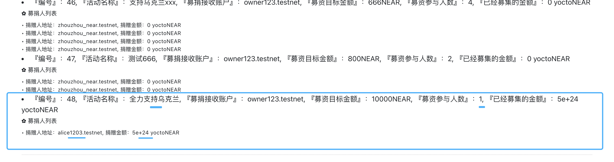

## 关于我
| 姓名 | 专长 | 沟通方式 |
| :-----| ----: | :----: |
| 州州 | web2，web3 | 微信：736077330 |